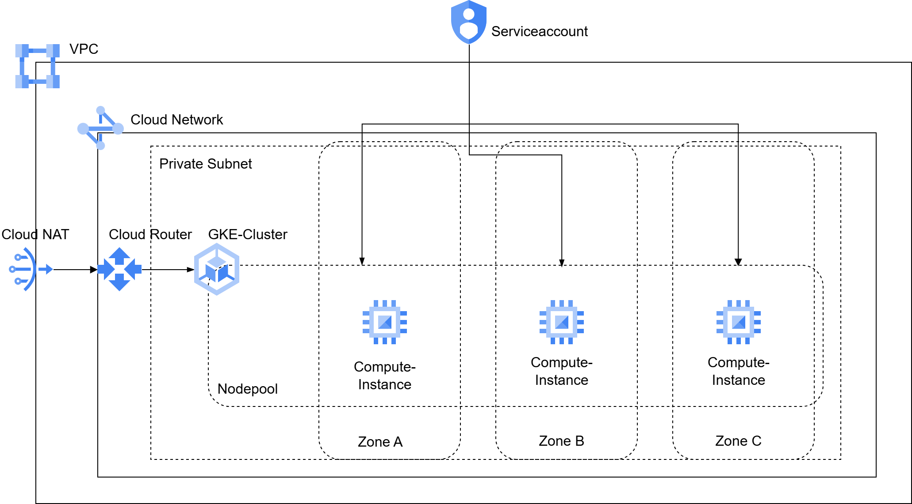

# Simple GKE regional Standard-Cluster

This self written Terraform module provisions the infrastructure for a standard regional GKE-Cluster with private nodes



### Resources

- VPC + regional subnet for GKE-Infrastructure
- IAM-Serviceaccount for managig nodes and clusters 
- Cloud-Nat gateway + router for outbound traffic
- Standard GKE-Cluster with private node pool

```
├── gke_infra_setup.tf
├── main.tf
├── module
│   ├── cloud_nat.tf
│   ├── cluster.tf
│   ├── iam.tf
│   ├── main.tf
│   ├── outputs.tf
│   ├── variables.tf
│   └── vpc.tf
├── outputs.tf
└── variables.tf
```

The required firewall rules of the network for the GKE-Cluster are automatically created by the gke-module. 

### Usage

#### Exampe tfvars-file:

```
gcp_project_id            = "project-id"
gcp_region                = "europe-west1"
gke_service_account_id    = "gke-sa"
gke_subnetwork_region     = "europe-west1"
gke_subnetwork_cdir_range = "10.10.0.0/16"
gke_cluster_name_suffix   = "cute-puppy"
gke_ip_range_pods         = "172.10.0.0/16"
gke_ip_range_services     = "192.10.0.0/22"
gke_node_count            = 1
gke_subnetwork_name       = "gke-infra-subnet"
gke_vpc_network_name      = "gke-infra-network"
iam_service_account_members = [
  "allAuthenticatedUsers"
]
gke_node_locations = [
  "europe-west1-b",
  "europe-west1-c",
  "europe-west1-d"
]
```

To provision the infrastructure, run:


```
terraform plan
```

```
terrafrom apply
```

To remove infrastructure, run:

```
terrafrom destroy
```